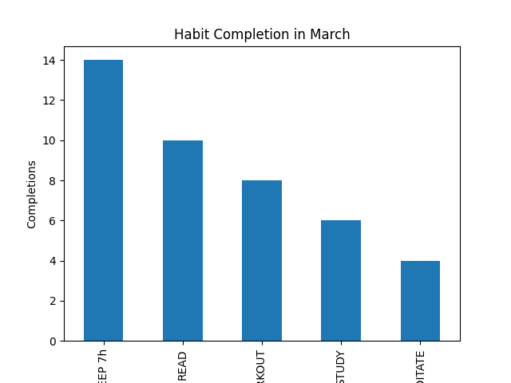
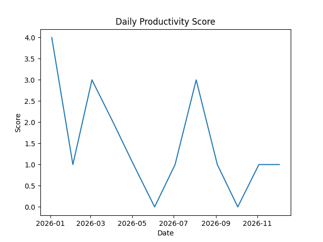

# Habit Tracker Data Analysis

## Objective
The goal of this project is to analyze daily habits and identify patterns in consistency and productivity over time.

## Dataset
The dataset contains daily records of habits such as reading, workout, study, meditation, sleep (7h), and a productivity score.

## Data Cleaning
- Converted DATE column to datetime format
- Selected relevant columns for analysis
- Transformed boolean values (TRUE/FALSE) into numerical values (1/0)
- Handled missing values
- Ensured all habit columns are numeric for analysis

## Analysis

### Habit Completion
A bar chart was created to show the total completion of each habit during the month.

### Productivity Trend
A line chart was used to analyze how the productivity score changes over time.

## Insights
- Sleep (7h) is the most consistent habit
- Meditation is the least consistent habit
- Workout and study show moderate consistency
- Productivity fluctuates significantly over time

## Conclusion
This analysis shows that maintaining consistent habits, especially sleep, plays a key role in overall productivity.

Improving less consistent habits like meditation and study could help stabilize and improve performance over time.

## Tools Used
- Python
- Pandas
- Matplotlib

## Visualizations

### Habit Completion

### Productivity Trend
